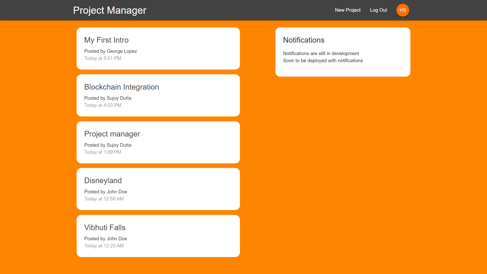

# Project Mangement Tool

The goal of this app to was to create a Project Management Tool for teams so that they can share, create, delete, and update projects across an organization or multiple organization. With authentication and cloud functionalities providing more robust and standard features to the users to manage and keep a track of all their requirements all in one app. 

To build this I used React, Redux, React-Redux, Thunk, and Firebase.
This app consists of authentication and authorisation from Firebase and additional features like Cloud security, Route Guarding, Cloud functions.

[Click here to see the live demo](https://project-manager-7accb.web.app/)

# Tech Stack
* React
* Redux
* React-redux
* Redux-thunk
* React-router-dom
* Materialize-css
* Firebase
* React-redux-firebase
* Redux-firestore
* Moment.js
* Cloud Functions
* Firebase Auth
* Firebase Security
* Firebase Hosting

# Build
This app is built using a bunch of packages, front-end is mostly consists of React, Materialize-CSS and Redux for state-management. But soon there was a requirement of asynchronous behavior, for such condition Redux-Thunk was used to allow asynchronous communication between the React app and the Firebase DB. Redux-Thunk is a middleware that is a function and unlike a regular function, it halts the dispatch just like ES6 Generators. It performs async requests and then resumes the dispatch after getting all the information or sending information. In most cases, external data is grabbed and passed to the reducers. The dates are formatted using Moment.js.
All the pages are routed using a package called React-router-dom. The connection between React and Redux is made by using a package called React-Redux. 
Firebase packages like React-redux-firebase & Redux-firestore allows us to connect to the firestore and pull data from firestore and render it.

The backend was mostly consists of Firebase - the database is a No-SQL Firestore DB, the server-side code was implemented by using Firebase Cloud Functions and authorisation and authentication of users was controlled by using Firebase Auth.
The app is secured using Firebase Security rules and it is hosted using Firebase.

# Future Scope
This app will have real-time notifications, which will allow users to get notified of activities like if you delete a project, create a new project or edit one, then a  notification will pop in the sidebar in real-time. A proper dashboard is what I'm building now. 
